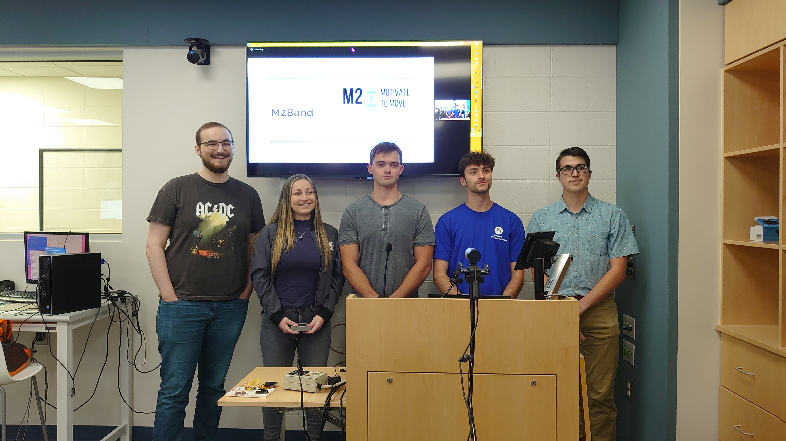

# Thursday, May 12, 2022

## uBASS

> TIME: 14:35

> "Daniel DeSantis" <dmdesant@udel.edu>
> "Cameron Frey" <camfrey@udel.edu>
> "Alex Hayes" <ajchayes@udel.edu>
> "Dylan Laplace" <dlaplace@udel.edu>

* Nice Presentation
  * lots of pictures
  * clear block diagrams
  * meaningful diagrams
  * good descriptions of components
  * great live demo
  * standards and constraints
* Delivered Working Prototype
  * beautiful design
* Solid Work Effort!

## Indoor Autonomous Disinfecting Robot

> TIME: 26:57

> "Haifeng Huang" <rick@udel.edu>
> "Yucheng Niu" <uydstyu@udel.edu>
> "Shihao Xiong" <kenney@udel.edu>
> "Yi Zhen" <yizhen@udel.edu>

* Good Presentation
  * lots of pictures
  * simple high-level block diagrams
  * several demo videos
  * good debugging (log formatted) videos
  * nice slides covering each sensor and component
  * detailed budget slide
  * standards and constraints
* Delivered Working Prototype
  * nice robot design
  * good placement of UV strip
* Good Work Effort
  * need a better algorithm to process distance from sonar sensors

## Fire Fighters

> TIME: 14:37

> "RJ Dawson" <rjdawson@udel.edu>
> "William Shahan" <wmshahan@udel.edu>
> "Shell Shetti" <sshetti@udel.edu>
> "Ben Weinel" <bweinel@udel.edu>

* Nice Presentation
  * lots of pictures
  * good breakdown of equations
  * clear explanation of comunication framework they designed
  * great live demo of UI (no PCB, just discussed?)
  * nice slides covering each sensor and component
  * standards and constraints
* Delivered Working Prototype
  * awesome UI (offline support)
* Good Work Effort

## Malware Analysis Tool

> TIME: 17:20

> "Brandon Brooks" <brooksbr@udel.edu>
> "Liam Jordan" <lkj@udel.edu>
> "Christopher-Neil Mendoza" <mendozac@udel.edu>
> "Alex Pickett" <aepick@udel.edu>

* Nice Presentation
  * lots of pictures
  * nice demo video of webUI
  * great work on detecting novel malware
  * good features engineering and evaluating feature selection
* Delivered Working Prototype
  * nice electron webUI design
* Good Work Effort
  * need a better algorithm to process distance from sonar sensors

## M2 Band

> TIME: 

> "Luke Fanizzi" <lfanizzi@udel.edu>
> "Angelina Gargiulo" <angie@udel.edu>
> "Matt Greenlee" <mattg@udel.edu>
> "Mike Joyce" <joycem@udel.edu>
> "Drew Koense" <dkoense@udel.edu>

* Nice Presentation
  * lots of pictures
  * good breakdown of equations
  * standards and constraints
* Delivered Working Prototype
  * nice robot design
* Good Work Effort
  * need a better algorithm to process distance from sonar sensors

## Pianists

> TIME: 

> "Justin Clavette" <jdclav@udel.edu>
> "Sebastian Cortes" <scortesz@udel.edu>
> "Nick Kater" <njkater@udel.edu>
> "Dang Nguyen" <dnguyen@udel.edu>

* Nice Presentation
  * lots of pictures
  * good breakdown of equations
  * standards and constraints
* Delivered Working Prototype
  * nice robot design
* Good Work Effort
  * need a better algorithm to process distance from sonar sensors

# Tuesday, May 17, 2022

## Sample

> TIME: s

* Nice Presentation
  * lots of pictures
  * good breakdown of equations
  * standards and constraints
* Delivered Working Prototype
  * nice robot design
* Good Work Effort
  * need a better algorithm to process distance from sonar sensors

